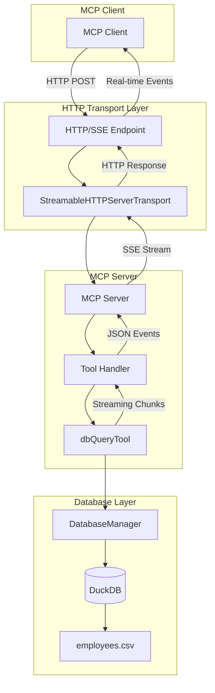
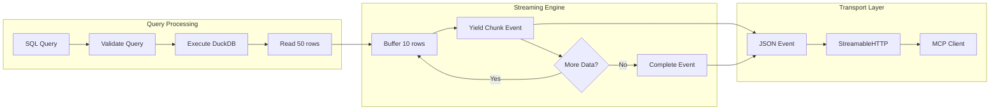
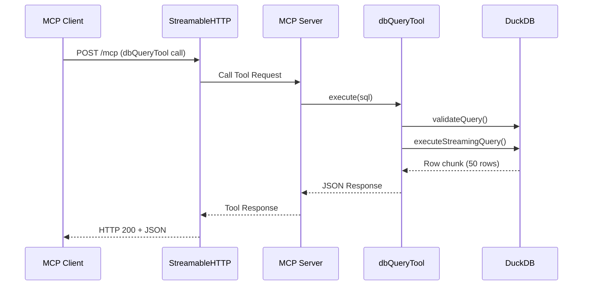
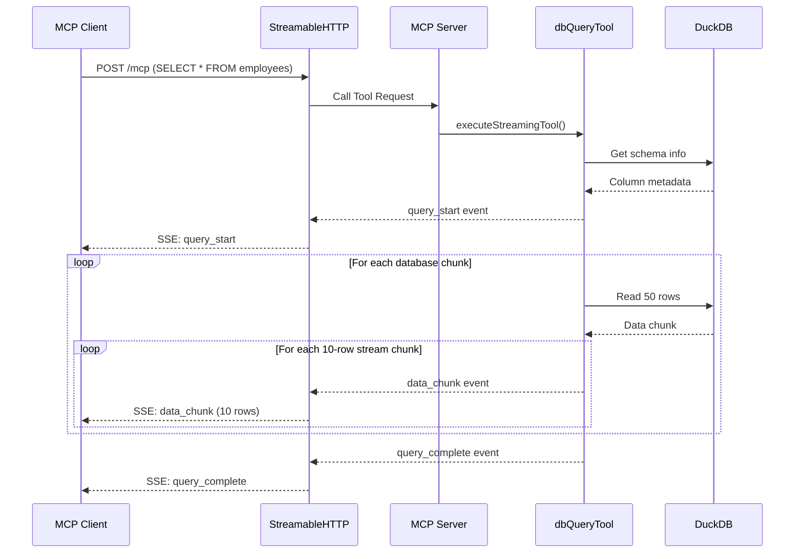
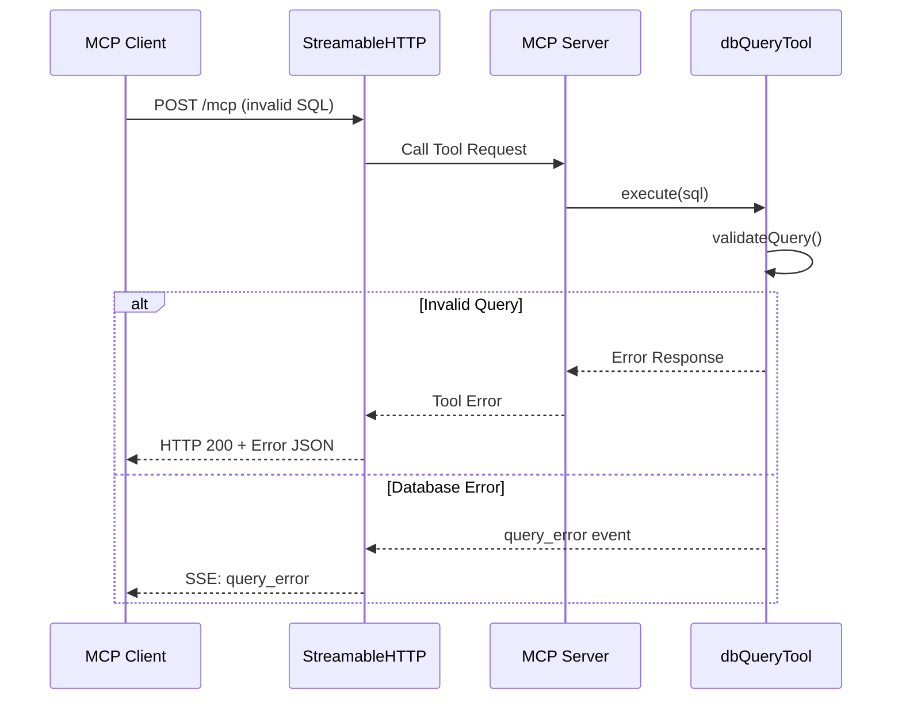

# MCP DuckDB Server with Streaming Support

A Model Context Protocol (MCP) server implementation with DuckDB integration and real-time streaming capabilities using StreamableHTTPServerTransport.

## Overview

This project implements a production-ready MCP server that provides database query capabilities through a `dbQueryTool`. The server streams query results in real-time chunks of 10 rows, making it ideal for handling large datasets efficiently.

## Features

- 🚀 **StreamableHTTPServerTransport**: Modern MCP transport with HTTP-based streaming
- 🗄️ **DuckDB Integration**: In-memory database with CSV data loading
- 📊 **Real-time Streaming**: Query results delivered in 10-row chunks
- 🔒 **Security**: SQL validation (SELECT only) with injection protection
- ⚡ **TypeScript**: Full type safety with modern Node.js support
- 📈 **Scalable**: Handles large datasets without memory issues

## Architecture Overview



## Streaming Flow Architecture



## Sequence Diagrams

### Basic Query Flow



### Streaming Query Flow



### Error Handling Flow



## Event Types

### Query Start Event
```json
{
  "type": "query_start",
  "data": {
    "query": "SELECT * FROM employees",
    "columns": ["employeeId", "employeeName", "location", "startDate"],
    "timestamp": "2025-09-18T11:05:00.000Z"
  }
}
```

### Data Chunk Event
```json
{
  "type": "data_chunk",
  "data": {
    "chunk": [
      {"employeeId": 1, "employeeName": "John Smith", "location": "New York", "startDate": "2020-01-15"},
      {"employeeId": 2, "employeeName": "Sarah Johnson", "location": "San Francisco", "startDate": "2019-03-22"}
    ],
    "chunkNumber": 1,
    "rowsInChunk": 10,
    "totalRowsSoFar": 10
  }
}
```

### Query Complete Event
```json
{
  "type": "query_complete",
  "data": {
    "totalRows": 50,
    "totalChunks": 5,
    "executionTime": 25,
    "completed": true
  }
}
```

## Installation and Setup

### Prerequisites
- Node.js 18+ (22+ recommended for native TypeScript support)
- npm or yarn

### Installation
```bash
# Clone the repository
git clone <repository-url>
cd mcp-stream

# Install dependencies
npm install
```

### Development Commands
```bash
# Start development server (native TS support)
npm run dev

# Start development server (fallback)
npm run dev:fallback

# Build for production
npm run build

# Run production build
npm run start

# Test streaming functionality
npm run test:streaming
```

## Usage

### Starting the Server
```bash
npm run dev
```

The server will start on `http://localhost:3000` with the following endpoints:
- **MCP Endpoint**: `http://localhost:3000/mcp`
- **Health Check**: `http://localhost:3000/health`
- **Schema Info**: `http://localhost:3000/schema`

### Connecting with MCP Client

Configure your MCP client to connect to:
```
http://localhost:3000/mcp
```

### Using the dbQueryTool

```javascript
// MCP Tool Call
{
  "name": "dbQueryTool",
  "arguments": {
    "sql": "SELECT * FROM employees WHERE location = 'New York'",
    "limit": 50  // Optional
  }
}
```

### Natural Language Demo Examples

Perfect for demonstrating LLM integration! Here are natural language inputs that showcase the server's capabilities:

#### 📊 **Basic Data Exploration**
- *"How many employees do we have in total?"*
- *"Show me all employees from California"*
- *"List the first 10 employees with their details"*
- *"What states do we have offices in?"*

#### 💰 **Salary and Compensation Analysis**
- *"What's the average salary by department?"*
- *"Show me the highest paid employees"*
- *"Which department has the highest payroll costs?"*
- *"Find employees earning over $120,000"*
- *"Compare average salaries between remote and office workers"*

#### 🏆 **Career Development and Promotions**
- *"Who is ready for promotion this year?"*
- *"Show me employees who haven't been promoted in 3+ years"*
- *"Which department promotes people most frequently?"*
- *"Find high-potential candidates for leadership roles"*
- *"Show the engineering career ladder progression"*

#### 🎉 **Anniversary and Recognition**
- *"Who has 10-year anniversaries coming up?"*
- *"Show me our longest-serving employees"*
- *"Find employees celebrating 15 years with the company"*
- *"List all VP-level employees and their tenure"*

#### 🏢 **Remote Work and Location Analysis**
- *"What percentage of each department works remotely?"*
- *"Which states have the most remote workers?"*
- *"Show me office vs remote salary differences by department"*
- *"Find all engineering managers who work remotely"*

#### 📈 **Hiring and Growth Trends**
- *"How many people did we hire each year since 2020?"*
- *"What's our hiring trend by department over time?"*
- *"Show me recent hires who might need performance reviews"*
- *"Which year had the highest average starting salaries?"*

#### 🔍 **Advanced Analytics**
- *"Identify employees who might be flight risks based on promotion gaps"*
- *"Show me salary outliers in each department"*
- *"Find correlation between tenure and remote work preferences"*
- *"Which employees have the steepest career progression?"*

### Sample SQL Queries

```sql
-- Basic queries
SELECT * FROM employees LIMIT 10;
SELECT COUNT(*) FROM employees;

-- Enhanced aggregation with new columns
SELECT department, location, COUNT(*) as employee_count, AVG(salary) as avg_salary
FROM employees
GROUP BY department, location
ORDER BY avg_salary DESC;

-- Promotion analysis
SELECT employeeName, position,
       CASE WHEN lastPromoted IS NULL THEN 'Never promoted'
            ELSE 'Last promoted: ' || lastPromoted END as promotion_status
FROM employees
WHERE EXTRACT(YEAR FROM startDate) <= 2022
ORDER BY startDate;
```

## Database Schema

| Column | Type | Description |
|--------|------|-------------|
| employeeId | INTEGER | Unique employee identifier |
| employeeName | VARCHAR | Full name of employee |
| location | VARCHAR | Work location (US states) |
| startDate | DATE | Employment start date |
| department | VARCHAR | Engineering, Sales, Marketing, HR, Finance |
| salary | INTEGER | Annual salary in USD |
| position | VARCHAR | Job title (Software Engineer to VP level) |
| isRemote | BOOLEAN | Remote work status |
| lastPromoted | DATE | Date of last promotion (NULL if never promoted) |

### Dataset Overview
- **70 employees** across 8 US states
- **Career progression**: 2018-2025 hires with realistic promotion timelines
- **10-15 year veterans**: VP and Executive level positions
- **Complete career ladder**: From entry-level to VP positions
- **Remote work data**: Mixed in-office and remote employees

## Configuration

### Environment Variables
- `PORT`: Server port (default: 3000)
- `HOST`: Server host (default: localhost)

### Streaming Configuration
- **Stream Chunk Size**: 10 rows per event
- **Database Chunk Size**: 50 rows per database read
- **Response Format**: JSON events via StreamableHTTP

## Security Features

- ✅ **SQL Validation**: Only SELECT statements allowed
- ✅ **Keyword Filtering**: Dangerous operations blocked (DROP, DELETE, UPDATE, INSERT)
- ✅ **Input Validation**: All parameters validated
- ✅ **Result Limits**: Configurable row limits
- ✅ **Error Handling**: Comprehensive error responses

## Testing

### Manual Testing
```bash
# Test health endpoint
curl http://localhost:3000/health

# Test schema endpoint
curl http://localhost:3000/schema

# Test streaming behavior
npm run test:streaming
```

### Expected Streaming Behavior

For a query returning 25 rows:
1. **Event 1**: `query_start` with metadata
2. **Event 2**: `data_chunk` with rows 1-10
3. **Event 3**: `data_chunk` with rows 11-20
4. **Event 4**: `data_chunk` with rows 21-25
5. **Event 5**: `query_complete` with summary

## Dependencies

### Production
- `@modelcontextprotocol/sdk@^1.18.0`: MCP protocol implementation
- `@duckdb/node-api@^1.3.4-alpha.27`: Modern DuckDB client
- `express@^4.21.2`: HTTP server framework

### Development
- `typescript@^5.7.3`: TypeScript compiler
- `ts-node-dev@^2.0.0`: Development runtime
- `@types/node` & `@types/express`: Type definitions

## Project Structure

```
├── src/
│   ├── server.ts              # Main MCP server
│   ├── tools/
│   │   └── dbQueryTool.ts     # Database query tool
│   ├── database/
│   │   └── db.ts              # DuckDB operations
│   └── types/
│       └── index.ts           # TypeScript interfaces
├── data/
│   └── employees.csv          # Sample data (50 employees)
├── test-streaming-chunks.ts   # Streaming test script
├── package.json
├── tsconfig.json
├── CLAUDE.md                  # Claude Code guidance
└── README.md
```

## Contributing

1. Fork the repository
2. Create a feature branch
3. Make your changes
4. Add tests for new functionality
5. Ensure all tests pass
6. Submit a pull request

## License

MIT License - see LICENSE file for details.

## Support

For issues and questions:
- Create an issue in the GitHub repository
- Check the CLAUDE.md file for development guidance
- Review the MCP documentation at https://modelcontextprotocol.io

## LLM Integration Guide

### Perfect for AI Assistants

This MCP server is designed to showcase how LLMs can interact with structured data through natural language. The rich dataset enables complex analytical conversations.

### Demo Script for LLMs

1. **Start with basics**: *"How many employees do we have?"*
2. **Explore departments**: *"What's the breakdown by department?"*
3. **Dive into salaries**: *"Show me salary ranges by department"*
4. **Career progression**: *"Who needs promotions?"*
5. **Remote work analysis**: *"How does remote work vary by location?"*
6. **Advanced insights**: *"Find potential flight risks"*

### Sample LLM Conversation Flow

```
Human: "Show me our highest paid employees"

LLM: I'll query the employee database to find the highest paid employees.

[Calls dbQueryTool with: SELECT employeeName, position, salary, department, location
FROM employees ORDER BY salary DESC LIMIT 10]

The highest paid employees are:
1. Charles Wilson - VP Engineering ($155,000) - Texas
2. Steven Martin - VP Engineering ($152,000) - California
3. Daniel White - VP Engineering ($150,000) - Washington
4. Helen Rodriguez - VP Engineering ($149,000) - Massachusetts
5. Matthew Garcia - VP Sales ($148,000) - Texas
Human: "Who is ready for promotion?"
LLM: Let me check for employees who are due for promotion based on their last promotion date and tenure.

[Complex promotion analysis query...]

Found 12 employees ready for promotion:
- High Priority: Michael Brown (Software Engineer, 3+ years, never promoted)
- Medium Priority: Angela Reed (Senior SWE, promoted 2+ years ago)
```

### Key Demo Features
- **Rich dataset**: 70 employees with 9 columns of realistic data
- **Natural conversations**: Complex queries from simple questions  
- **Real-time streaming**: 5-row chunks with 1-second delays
- **Career insights**: Promotion analysis, salary trends, remote work patterns
- **Multi-dimensional**: Location, department, tenure, salary, promotion data

---

**Built with ❤️ using Model Context Protocol and DuckDB**

